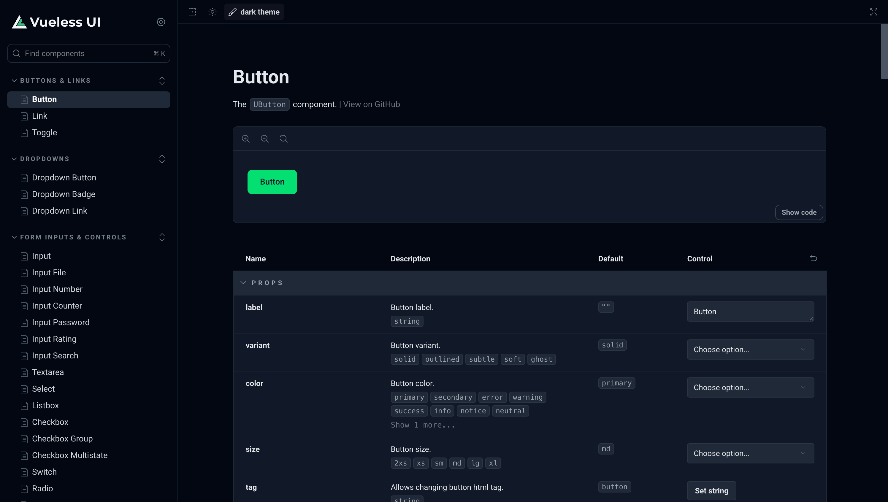

# Vueless Storybook preset

Zero config preset to launch a tailored Storybook instance for a [Vueless UI](https://github.com/vuelessjs/vueless).

[Documentation](https://docs.vueless.com/installation/storybook/) | [Demo](https://ui.vueless.com/) | [About Vueless UI](http://vueless.com/)

## Installation

```bash
# Install Vueless UI
npm install vueless

# Install Vueless Storybook preset
npm install -D @vueless/storybook

# Copy Vueless Storybook preset into your project
npx @vueless/storybook init
```

## Contributing

* We encourage you to contribute to Vueless! Please check out the
  [contributing to Vueless](CONTRIBUTING.md) for guidelines.
* Trying to report a possible security vulnerability in Vueless? Please
  check out our [security policy](SECURITY.md) for guidelines.
* Everyone interacting in Vueless and its sub-projects' codebases, issue trackers, chats, and mailing lists is expected to follow our [code of conduct](CODE_OF_CONDUCT.md) rules.

## License

Vueless is released under the [MIT License](https://opensource.org/licenses/MIT).

---
From Ukrainians to a Peaceful World 🇺🇦